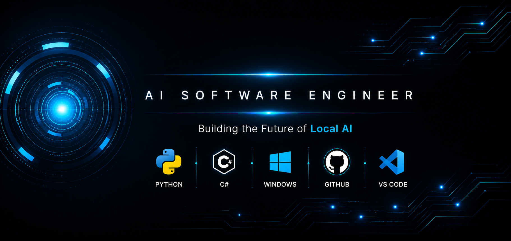

  

 

<h1 align="center">👋 Hi, I'm Bryant Brugal</h1>

<h3 align="center">
Building the Future of Local AI for Windows
</h3>

AI Software Engineer • Python & C# Developer • Windows Automation

---

# 🚀 About Me

I'm a Software Engineer from the **Dominican Republic**, currently based in the **United States**, passionate about Artificial Intelligence, desktop software, and Windows automation.

I earned my **Bachelor's Degree in Computer Science** from the **Universidad Autónoma de Santo Domingo (UASD) – San Pedro de Macorís Campus** on **May 9, 2019**.

My mission is to build fast, private, and intelligent desktop applications that run entirely on the user's computer.

I believe the future of AI is **local, private, and fully under the user's control.**

---

# 🎓 Education

🎓 **Bachelor's Degree in Computer Science**

**Universidad Autónoma de Santo Domingo (UASD)**

San Pedro de Macorís Campus

📅 Graduated: **May 9, 2019**

---

# 🛠️ Tech Stack

### 💻 Programming Languages

- 🐍 Python
- 💜 C#
- 🌐 HTML5
- 🎨 CSS3
- ⚡ JavaScript

### 🗄️ Databases

- 🐬 MySQL
- 🗄️ Microsoft SQL Server

### 🤖 Artificial Intelligence

- Local Large Language Models (LLMs)
- LM Studio
- Whisper
- XTTS
- AI Agents
- Retrieval-Augmented Generation (RAG)
- Prompt Engineering

### 🖥️ Desktop Development

- Windows API
- CustomTkinter
- OBS WebSocket
- FFmpeg
- Inno Setup

### 🛠️ Tools

- Git
- GitHub
- Visual Studio
- Visual Studio Code

---

# 🤖 Featured Projects

## 🤖 V.I.E.R.N.E.S.

**V.I.E.R.N.E.S. (Virtual Intelligent Executive Responsive Neural Enhanced System)** is my flagship project.

A next-generation Local AI Assistant for Windows designed to run entirely on the user's computer while providing voice interaction, persistent memory, Windows automation, and high-performance local AI capabilities.

### Core Features

- 🎙️ Natural Voice Interaction
- 🧠 Local LLM Integration
- 💾 Persistent Memory
- 🪟 Windows Automation
- ⚡ High Performance
- 🔒 Privacy First
- 🧩 Modular Architecture
- 👨‍💻 Developer Mode

---

## 🎬 CutClip

**CutClip** is a professional Instant Replay Manager compatible with OBS Studio.

Designed for streamers and content creators who need fast and reliable replay management.

### Core Features

- 🎬 Replay Buffer Support
- 🔌 OBS WebSocket Integration
- ✂️ Automatic FFmpeg Trimming
- ⌨️ Native Windows Hotkeys
- 📦 Windows Installer
- ⚡ Lightweight Architecture

---

# 🎯 Current Goals

- 🤖 Continue developing V.I.E.R.N.E.S.
- 🚀 Build professional AI software for Windows.
- 🧠 Expand Local AI capabilities.
- ⚡ Create high-performance desktop applications.
- 📚 Continue learning new Artificial Intelligence technologies.

---

# 🚀 Vision

I believe Artificial Intelligence should be:

- 🔒 Private
- ⚡ Fast
- 🖥️ Local
- 🧠 Intelligent
- 👤 Fully controlled by the user

This vision inspires every project I build, especially **V.I.E.R.N.E.S.** and **CutClip**.

---

# 💡 Philosophy

> **"I don't just write software. I build intelligent tools that empower people while keeping their data private and under their control."**

---

⭐ Thank you for visiting my GitHub profile!

